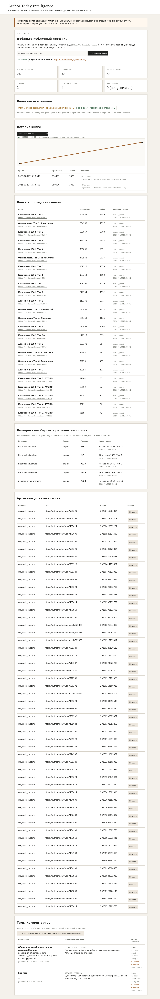

# Author.Today Intelligence

Локальный прототип для автора, который отвечает на простой вопрос:

> **Что изменилось у моих книг, где они видны в релевантных топах и на каких исходных данных основан каждый вывод?**



## Что это сейчас

Это **evidence-first технический прототип**, проверенный на публичном портфеле Сергея Насоновского. Это не готовый SaaS и не замена кабинета Author.Today.

На контрольном срезе 17 июля 2026 года он показывает:

| Объект | Проверенный объём |
|---|---:|
| Публичные произведения Сергея | 24: 19 электронных и 5 аудиокниг |
| Сопоставимые публичные снимки | 2 × 24 = 48 точек |
| Отслеживаемые выдачи | 4 общие + 6 жанровых |
| Ограниченный аудит Wayback | 53 снимка для 14 из 24 произведений |
| Реальная ручная выборка комментариев | 2 комментария, 1 ветка, 1 подтверждённый тег |

Реальная выборка комментариев хранится только локально и не публикуется в репозитории. Репозиторий содержит синтетический пример для тестов.

## Что увидит Сергей

1. **Автор и портфель.** Явно выбран профиль `https://author.today/u/nasonovsky`; показаны все 24 публичных произведения.
2. **Динамика.** Для книги видны график, исходные значения, точное время и формула. Например: `990 524 − 990 495 = +29 просмотров`.
3. **Релевантные топы.** Общие выдачи не смешиваются с жанровыми. Наблюдаются `Альтернативная история`, `Исторические приключения` и `Попаданцы во времени`, режимы `popular` и `trending`, окно top-25.
4. **Комментарии как доказательства.** Путь выглядит так: `тег → наблюдение → точная цитата → полный текст → ветка → профиль → оригинал`.
5. **Качество источника.** Регулярный публичный снимок, ручная выборка и нерегулярная архивная точка подписаны раздельно.

## Что нельзя заключать

- Отсутствие книги в top-25 не означает отсутствие во всём рейтинге.
- Два снимка позволяют посчитать изменение, но ещё не сезонный тренд.
- Архивные снимки нерегулярны и не образуют непрерывную историю.
- Наблюдаемая выборка не является «всем рынком Author.Today».
- Корреляция не доказывает причину.
- UI не создаёт гипотезы автоматически: по умолчанию их количество равно нулю.

## Точный состав мониторинга

Действующий 14-дневный мониторинг делает публичный снимок каждые 6 часов. Статистические сутки трактуются в часовом поясе Москвы (`UTC+3`). Накопленные снимки дописываются, а не перезаписываются.

### Общий сравнительный контекст

- `all / popular`, первые 20 позиций;
- `all / trending`, первые 20;
- новые популярные книги, первые 20;
- последние публикации, первые 20.

### Жанры Сергея

- `sf-history / popular`, top-25;
- `sf-history / trending`, top-25;
- `historical-adventure / popular`, top-25;
- `historical-adventure / trending`, top-25;
- `popadantsy-vo-vremeni / popular`, top-25;
- `popadantsy-vo-vremeni / trending`, top-25.

Старые общие снимки не переименовываются задним числом в жанровые. Жанровый временной ряд начинается с момента добавления этих категорий.

Подробный аудит: [MONITORING_AUDIT_2026-07-17.md](docs/MONITORING_AUDIT_2026-07-17.md).

## Запуск в чистом clone

### Docker

```bash
git clone https://github.com/Topleess/author-today-intelligence.git
cd author-today-intelligence

docker compose --profile sync run --rm public-sync
docker compose up -d controller
curl http://127.0.0.1:8787/api/health
```

Откройте <http://127.0.0.1:8787>.

Повторный разрешённый публичный снимок:

```bash
docker compose --profile sync run --rm public-sync
```

Остановить, сохранив SQLite volume:

```bash
docker compose down
```

`docker compose down -v` удаляет локальные данные, поэтому используйте его только намеренно.

### Python

Проект не требует сторонних runtime-зависимостей:

```bash
python3 -m venv .venv
. .venv/bin/activate
pip install -e .

atintel author-add https://author.today/u/nasonovsky --name "Сергей Насоновский"
atintel bootstrap --sorting popular --output raw/popular.json --db analytics.sqlite3
atintel serve --db analytics.sqlite3
```

## Комментарии и правовая граница

Оферта Author.Today ограничивает использование программ и скриптов для сбора информации. Поэтому проект **не выпускает массовый или авторизованный сборщик комментариев**.

Безопасный путь:

1. владелец вручную выбирает ограниченный публичный материал в обычном браузере;
2. сохраняет локальный JSON с веткой, датой, автором, текстом и оригинальными URL;
3. импортирует его командой `atintel ingest selected-comments.json`;
4. вручную подтверждает цитату и тег.

Пароли, cookies, OTP, Authorization-заголовки, browser profile, `localStorage` и session material отклоняются.

Подробнее: [COMMENTS_EVIDENCE.ru.md](docs/COMMENTS_EVIDENCE.ru.md) и [MANUAL_IMPORT.md](docs/MANUAL_IMPORT.md).

## Архивы

Ограниченный аудит 24 явных URL дал покрытие `14/24` или `58,3%`. Плотность неоднородна: от 0 до 9 снимков на произведение. Поэтому массовый архивный backfill остановлен как недоказанный по полезности.

Архив используется только как отдельная evidence-точка с датой, URL и locator.

Подробнее: [SERGEY_ARCHIVE_AUDIT.ru.md](docs/SERGEY_ARCHIVE_AUDIT.ru.md).

## Проверка

```bash
python3 -m unittest discover -s tests -v
python3 scripts/privacy_scan.py
```

API намеренно read-only:

```bash
curl http://127.0.0.1:8787/api/summary
curl -i -X POST http://127.0.0.1:8787/api/summary  # ожидается HTTP 405
```

## Архитектура

```text
Публичный разрешённый снимок ─┐
Ручная выбранная выборка ─────┼─> local SQLite -> read-only API -> evidence-first UI
Wayback/Common Crawl audit ───┘
```

Нет SaaS, billing, облачного хранилища, приватного Chrome-worker или модуля защиты авторских прав.

## Документы

- [Аудит мониторинга](docs/MONITORING_AUDIT_2026-07-17.md)
- [Аудит архивов Сергея](docs/SERGEY_ARCHIVE_AUDIT.ru.md)
- [Evidence комментариев](docs/COMMENTS_EVIDENCE.ru.md)
- [Контракт API](docs/API_CONTRACT.md)
- [Модель данных](docs/DATA_MODEL.md)
- [Правовая граница](docs/RULES_AUDIT.md)
- [PDF-обзор](docs/Author.Today-Intelligence-Sergey.ru.pdf)

## Лицензия

MIT. Author.Today, содержимое сайта и товарные знаки принадлежат соответствующим правообладателям. Используйте проект с учётом актуальных правил платформы, приватности и разумных лимитов запросов.
